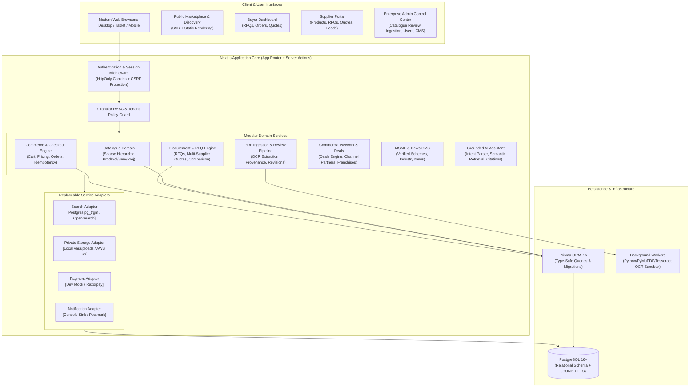
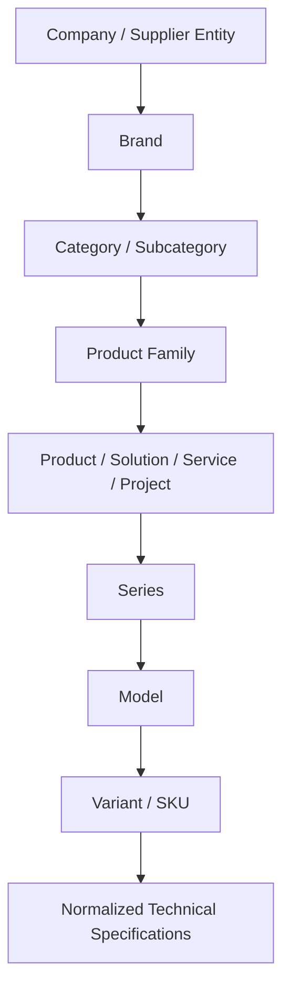
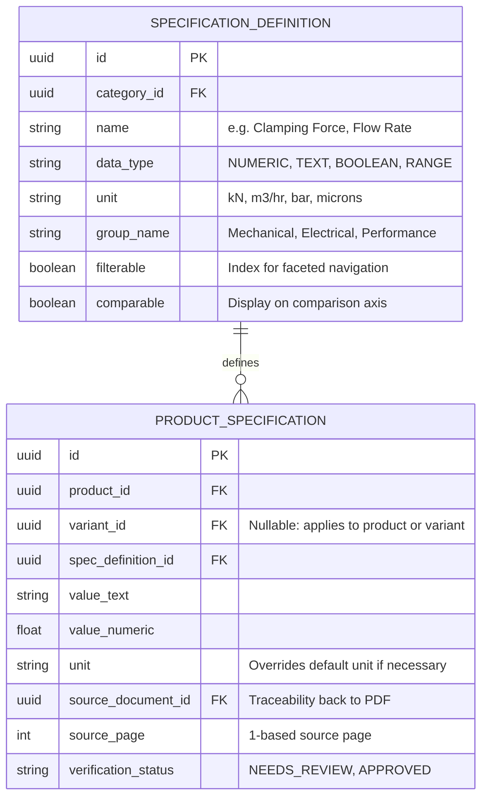
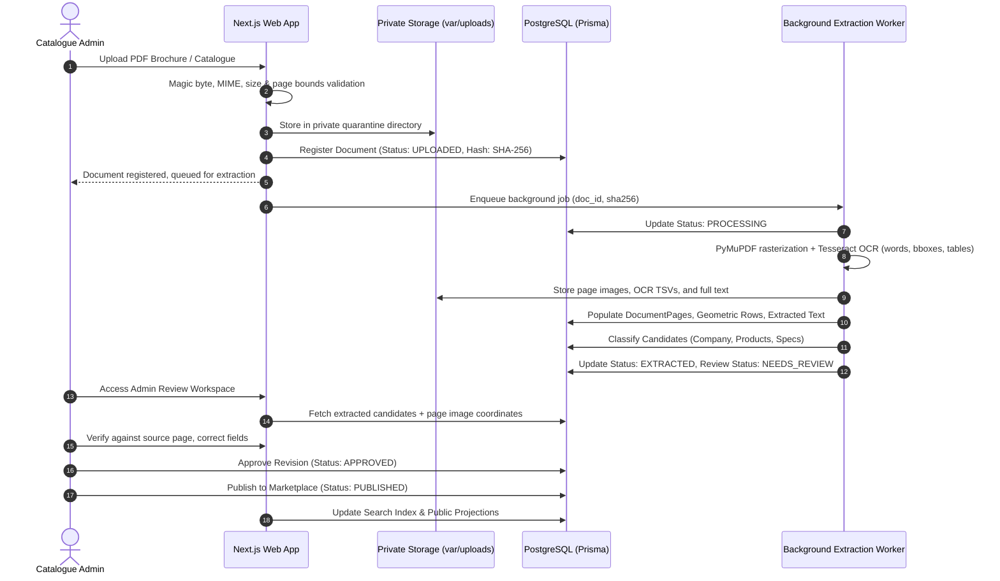
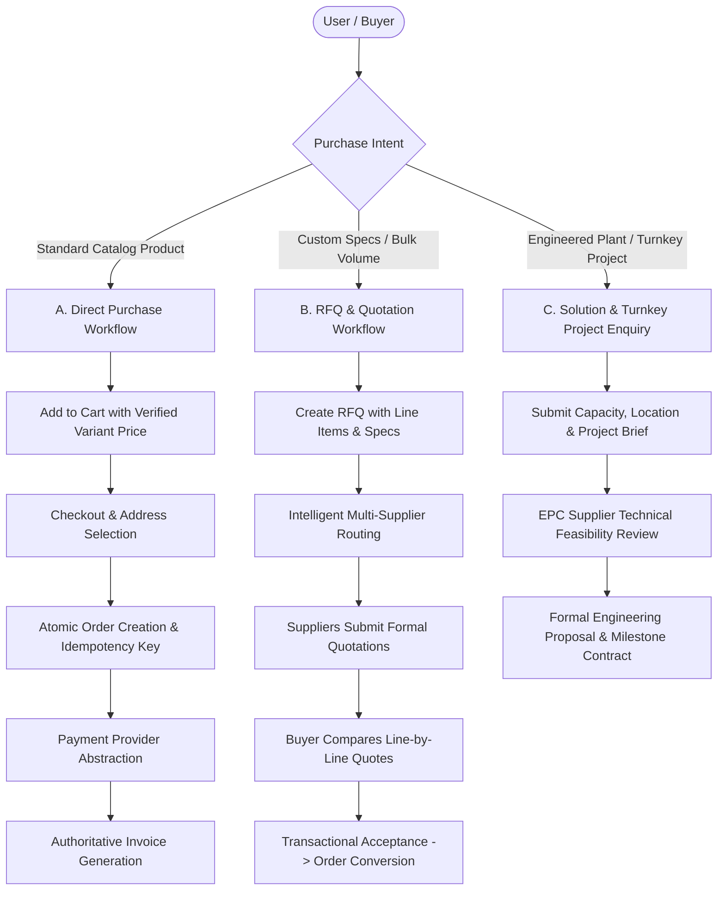

# YRC Global System Architecture

Status: Phase 0 Architectural Blueprint, 30 September 2026. Defines the modular monolith architecture, data contracts, security perimeters, and service boundaries for the YRC Global B2B + B2C industrial ecosystem.

---

## 1. Architectural Philosophy & Strategy

YRC Global is not a generic consumer storefront. It is an industrial B2B and B2C digital commerce ecosystem combining high-precision equipment catalogues, multi-tier procurement workflows, turnkey engineering proposals, supplier directories, business franchise opportunities, and MSME knowledge portals.

### Guiding Principles:
1. **Modular Monolith**: Clean domain boundaries within a unified Next.js (App Router) + TypeScript codebase. Enables low operational overhead, unified type safety from database to UI, atomic cross-domain transactions, and simplified local development.
2. **Replaceable Adapter Interfaces**: Clean interface contracts for external services (Search: Postgres FTS / OpenSearch; Storage: Local Disk / S3; Payments: Dev Mock / Razorpay; Email: Local Log / SendGrid / Postmark; AI: Grounded Retrieval / OpenAI / Gemini).
3. **Strict Source Traceability**: Every extracted catalogue fact maintains an immutable provenance trail (`source_document_id`, `source_file`, `source_page`, `extraction_method`, `confidence`, `review_status`).
4. **Mandatory Human-in-the-Loop Review**: Machine-extracted data (`NEEDS_REVIEW`) never touches public read surfaces until an authorized administrator explicitly reviews and publishes the revision.
5. **Decoupled Facet Taxonomies**: Product Categories, Industries, and Applications are independent, orthogonal dimensions.
6. **Granular Permission-Based RBAC**: Authorization is verified strictly on the server using granular capabilities (`catalogue.review`, `rfq.read_assigned`, etc.) constrained by tenant/company ownership, not simple UI hiding.

---

## 2. High-Level System Architecture Diagram



---

## 3. Modular Monolith Domain Boundaries

The application is structured into clearly separated domain packages under `src/modules/` or `src/lib/`:

```
src/
├── app/                      # Next.js App Router (Public routes, Portals, Admin)
│   ├── (public)/             # Public pages (Marketplace, Products, Companies, Deals, MSME, News)
│   ├── (auth)/               # Authentication (Login, Register, Reset, Verify)
│   ├── buyer/                # Authenticated Buyer Workspace (RFQs, Quotes, Orders)
│   ├── supplier/             # Authenticated Supplier Dashboard (Catalogue, RFQ responses)
│   ├── admin/                # Enterprise Admin Console (Review workspace, Ingestion, Roles)
│   └── api/                  # API endpoints, Webhooks, Health probes
├── modules/
│   ├── auth/                 # Session management, Password hashing, RBAC definitions
│   ├── catalogue/            # Products, Variants, Specifications, Categories, Industries, Applications
│   ├── ingestion/            # PDF registration, OCR workers, Revision control, Provenance
│   ├── procurement/          # RFQ submission, Multi-supplier distribution, Quotation comparison
│   ├── commerce/             # Cart validation, Server-authoritative totals, Orders, Invoices
│   ├── network/              # Deals engine, Channel partner directory, Franchise opportunities
│   ├── cms/                  # MSME scheme registry, Industry news, Editorial workflows
│   └── ai/                   # Grounded natural-language query parser, Catalog retrieval
└── lib/
    ├── adapters/             # Replaceable provider implementations (Search, Storage, Payment, Email)
    ├── db/                   # Prisma client singleton, connection pooling
    ├── security/             # Input sanitization, CSRF tokens, Rate limiting, Audit logging
    └── ui/                   # Design system tokens, accessible primitives, icons
```

---

## 4. Entity Architecture & Sparse Hierarchy

To handle heterogeneous industrial machinery, chemicals, turnkey projects, and services, the catalogue implements a sparse 8-level hierarchy:



### Classification Archetypes:
1. **PRODUCT**:
   - Physical equipment, machines, consumables, instruments.
   - Supports: Pricing mode (`FIXED_PRICE`, `PRICE_RANGE`, `PRICE_ON_REQUEST`, `BULK_PRICING`), Cart checkout (if priced and in-stock), or RFQ.
2. **SOLUTION**:
   - Engineered process schemes (e.g. `Effluent Treatment Plant`, `Zero Liquid Discharge`).
   - Supports: Capacity envelope, input/output characteristics, P&ID schematics, "Solution Enquiry" workflow.
3. **SERVICE**:
   - Intangible operational services (e.g. `Gas Analyzer Calibration`, `Boiler Descaling`, `O&M Contracts`).
   - Supports: Scope of work, service area coverage, hourly/annual retainer terms.
4. **PROJECT / TURNKEY SYSTEM**:
   - Large capital EPC contracts (e.g. `Bio-CBG Turnkey Plant`, `150T Weighbridge Installation`).
   - Supports: Scope boundaries (battery limits), civil/mechanical engineering requirements, milestone procurement RFQ.

---

## 5. Flexible Technical Specifications System

Different industrial domains have completely incompatible engineering attributes (e.g. Clamping force in kN for injection moulding machines vs. Pore size in microns for hollow fiber membranes vs. Methane percentage for biogas analyzers).

The specification subsystem utilizes an **EAV (Entity-Attribute-Value) with Typed Definitions** pattern:



---

## 6. PDF Ingestion & Intelligence Pipeline Architecture

The ingestion pipeline isolates untrusted binary files and CPU-intensive OCR processes from web requests:



---

## 7. Role-Based Access Control (RBAC) & Tenant Security

YRC Global enforces deny-by-default server-side authorization. Roles map to granular permission strings:

| Role Category | Roles | Core Capabilities |
|---|---|---|
| **Platform Admins** | `SUPER_ADMIN`, `ADMIN` | System configuration, role assignment, audit log inspection, provider toggles. |
| **Operational Staff** | `CATALOGUE_ADMIN`, `CONTENT_ADMIN` | PDF candidate review, item approval, publication, CMS moderation, SEO. |
| **Commercial Staff** | `SALES_ADMIN`, `SUPPORT_ADMIN` | RFQ triage, platform-wide quotation review, buyer assistance, dispute handling. |
| **Buyers** | `BUYER`, `BUSINESS_BUYER` | Catalogue search, RFQ creation, quote acceptance, cart checkout, order tracking. |
| **Suppliers** | `MANUFACTURER`, `SUPPLIER` | Own-company profile management, draft product creation, RFQ receipt & quotation response. |
| **Ecosystem Partners** | `CHANNEL_PARTNER`, `FRANCHISE_PARTNER` | Franchise inquiries, manufacturing unit directory, opportunity listings. |
| **Commercial Users** | `ADVERTISER` | Campaign management, banner asset submissions, impression/click metrics. |

### Authorization Guards:
- **Server Actions & Route Handlers**: Every mutating call validates session cookie, extracts caller user ID and role, and verifies required permission.
- **Tenant Scope Check**: When a user accesses an entity (e.g. Company profile, Quote, Order), the query enforces `company_id == user.active_company_id` or `user_id == session.user.id`.

---

## 8. Multi-Workflow Procurement & Commerce Engine

The platform supports three distinct commercial exchange modes:



---

## 9. Search & Grounded AI Assistant Architecture

### 9.1 Search Abstraction Layer
The search layer defines an abstract `SearchProvider` interface:
```typescript
interface SearchProvider {
  search(query: SearchQuery): Promise<SearchResults>;
  autocomplete(prefix: string): Promise<AutocompleteSuggestions>;
  reindex(entityType: string, entityId: string): Promise<void>;
}
```
- **Development & Small Deployments**: `PostgresSearchProvider` leveraging PostgreSQL `tsvector`, `tsquery`, GIN indexes, and `pg_trgm` fuzzy matching.
- **Production High-Scale**: `OpenSearchProvider` mapping approved catalogue projections to OpenSearch indices with sub-millisecond faceted filtering.

### 9.2 Grounded AI Assistant (No Hallucinations)
The discovery assistant uses **Retrieval-Augmented Generation (RAG)** strictly grounded in YRC's verified database:
1. **User Prompt**: "I need a 150 ton injection moulding machine with servo motor."
2. **Intent & Entity Extraction**: Parses `{ entity_type: 'PRODUCT', category: 'Plastics Machinery', clamping_force: 150, drive: 'Servo' }`.
3. **Database Retrieval**: Executes structured query returning `Prikan Ultra Servo US-150` (`PRIKAN.pdf`, Page 5).
4. **Response Synthesis**: Cites verified technical specs (1500 kN force, 510x510mm tie bar clearance, 22 kW motor) and provides clickable links to the product detail page and source catalogue page.
5. **Strict Guardrail**: If no verified catalogue record matches, the assistant replies: *"No published listings currently match these specifications. Would you like to create an RFQ to broadcast your requirements to registered manufacturers?"* It never fabricates fictional suppliers or specs.

---

## 10. Commercial Ecosystem: Deals, Advertising, MSME & News

- **Deals Engine**: Manages scheduled discounts, volume pricing tiers, and manufacturer clearance deals. Automatically transitions expired deals based on server UTC timestamp.
- **Advertising Engine**: Manages homepage hero carousels, category sponsored banners, and featured company badges. Strictly tracks impressions and clicks with fraud deduplication. Requires admin review before publishing ad creatives.
- **MSME Information Hub**: Structured repository of government schemes (e.g. PMEGP, CGTMSE, Credit Linked Capital Subsidy), eligibility criteria, application documents, and official ministry URLs.
- **Industry News & Current Affairs**: Full-featured CMS for publishing sector updates (Water, Energy, Waste, Manufacturing) with draft/review/schedule/publish states, tags, and SEO metadata.

---

## 11. Production Readiness, Observability & Security

- **Database Performance**: All foreign keys, slug lookups, status filters, and search vectors are indexed with dedicated B-Tree and GIN indexes.
- **Health Probes**: `/api/health` reports status of database connection, storage read/write accessibility, and worker queue heartbeat without exposing credentials.
- **Error Boundaries**: Next.js `error.tsx` and `global-error.tsx` catch client/server failures gracefully with error reporting hooks and user-friendly fallback actions.
- **Container Ready**: Dockerfile support for non-root execution, standalone Next.js server bundle, and secure environment variable injection.
