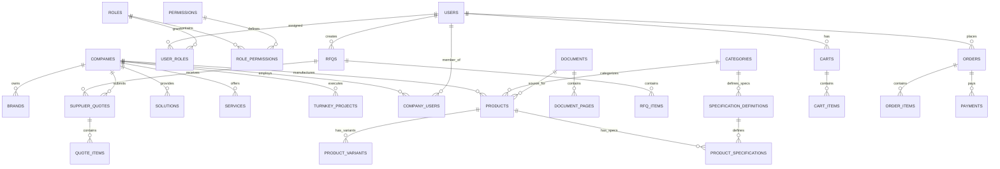

# YRC Global Database Schema Specification

Status: Complete Phase 0 Database Schema Specification, 30 September 2026. Derived directly from the multi-domain marketplace requirements and verified industrial catalogue analysis.

---

## 1. Database Architecture & Principles

1. **Relational Foundation**: PostgreSQL 16+ managed through Prisma ORM with strict foreign keys, cascade safety rules, and transaction guarantees.
2. **Primary Keys**: Universally Unique Identifiers (UUID v4 / standard ULID strings) for all entity records to prevent enumeration attacks and support distributed generation.
3. **Monetary Storage**: Stored strictly as **integer minor units** (e.g. Indian Paise: ₹1,500.00 = `150000`) alongside an ISO-4217 three-letter currency code (`INR`, `USD`). Missing prices remain explicitly `NULL` to represent "Request Quote".
4. **Source Provenance Columns**:
   Every catalogue entity, specification, and claim extracted from documents carries:
   - `source_document_id` (UUID, references `documents.id`)
   - `source_page` (Int, 1-based physical page)
   - `extraction_method` (Enum: `TESSERACT_OCR`, `PYMUPDF_TEXT`, `ADMIN_INPUT`)
   - `confidence` (Decimal, 0.00 to 100.00)
   - `review_status` (Enum: `NEEDS_REVIEW`, `APPROVED`, `REJECTED`)
5. **Decoupled Orthogonal Dimensions**:
   - `categories`: What the entity is (e.g., Roots Blowers, Biogas Analyzers).
   - `industries`: Economic vertical deploying the entity (e.g., Water Utilities, Sugar Mills).
   - `applications`: Functional mechanical process (e.g., Aeration, Vapor Extraction).
   Mapped via many-to-many junction tables (`product_industries`, `product_applications`, `company_industries`).

---

## 2. Core Entity-Relationship Diagram



---

## 3. Database Domain Breakdown

### Domain 1: Identity, Authentication & RBAC
- **`users`**: Core user authentication record (email, password_hash, status, phone, is_verified, timestamps).
- **`profiles`**: Personal profile details (first_name, last_name, job_title, avatar_url, preferences).
- **`addresses`**: Structured postal addresses (address_line1, line2, city, state, postal_code, country, gst_number).
- **`roles`**: System and business roles (`SUPER_ADMIN`, `CATALOGUE_ADMIN`, `BUYER`, `MANUFACTURER`, `SUPPLIER`, etc.).
- **`permissions`**: Granular security capabilities (`catalogue.review`, `rfq.read_assigned`, `orders.manage`).
- **`user_roles`**: Many-to-many assignment of roles to users.
- **`role_permissions`**: Granular mapping of permissions to roles.

### Domain 2: Companies, Brands & Supplier Directory
- **`companies`**: Commercial entities (legal_name, trade_name, slug, company_type, verified_status, logo_url, website, email, phone, gst_number, pan_number).
- **`company_users`**: Multi-tenant association between users and companies with specific tenant roles (`OWNER`, `MANAGER`, `MEMBER`).
- **`company_locations`**: Multiple office, plant, and warehouse addresses per company.
- **`brands`**: Commercial brand names under a company (e.g., `ALPHA BLOWERS` under `Somaiya Techno Products`).
- **`company_certifications`**: ISO, PESO, CE certifications with verification status.

### Domain 3: Multi-Level Product & Entity Catalogue
- **`categories`**: Hierarchical category tree (parent_id, name, slug, description, image_url, display_order).
- **`product_families`**: Intermediate product groupings within categories.
- **`products`**: Primary catalogue items with sparse hierarchy support:
  - Supports `entity_kind`: `PRODUCT`, `SOLUTION`, `SERVICE`, `TURNKEY_PROJECT`
  - Core fields: `name`, `slug`, `company_id`, `brand_id`, `category_id`, `short_description`, `full_description`, `pricing_mode`, `min_order_quantity`, `is_published`
  - Source tracking: `source_document_id`, `source_page`, `review_status`
- **`product_variants`**: Specific models or SKUs (sku, model_number, variant_name, price_minor_units, currency, stock_quantity, lead_time_days).
- **`product_images`**: High-resolution gallery images with alt text and display ordering.
- **`product_documents`**: Publicly downloadable brochures, datasheets, and operation manuals.

### Domain 4: Flexible Technical Specifications (EAV with Typed Schema)
- **`specification_definitions`**: Normalized attribute templates bound to categories:
  - `category_id`, `name` (e.g., Clamping Force), `data_type` (`NUMERIC`, `TEXT`, `BOOLEAN`, `RANGE`), `unit` (`kN`, `bar`, `m3/hr`), `group_name`, `is_filterable`, `is_comparable`
- **`product_specifications`**: Concrete attribute values bound to products or variants:
  - `product_id`, `variant_id`, `spec_definition_id`, `value_text`, `value_numeric`, `unit`, `source_page`, `verification_status`

### Domain 5: Independent Industries & Applications
- **`industries`**: Vertical economic sectors (name, slug, description, icon_name).
- **`applications`**: Functional engineering processes (name, slug, description).
- **`product_industries`**: Junction linking products/solutions to served industries.
- **`product_applications`**: Junction linking products/solutions to specific applications.
- **`company_industries`**: Industries served by the supplier overall.

### Domain 6: Procurement, RFQ & Quotation Management
- **`rfqs`**: Request for Quotation headers (rfq_number, buyer_user_id, title, status: `DRAFT`, `SUBMITTED`, `ROUTED`, `CLOSED`, delivery_location, target_date).
- **`rfq_items`**: Line items requested (product_id, custom_item_name, quantity, unit, technical_requirements).
- **`rfq_documents`**: Engineering drawings and BOQ attachments uploaded by buyer.
- **`supplier_quotes`**: Quotations submitted by suppliers (quote_number, rfq_id, supplier_company_id, status: `SUBMITTED`, `ACCEPTED`, `REJECTED`, `EXPIRED`, total_amount_minor_units, currency, validity_date, payment_terms).
- **`quote_items`**: Line items quoted by supplier (rfq_item_id, unit_price_minor_units, tax_rate, delivery_lead_days).

### Domain 7: Commerce, Carts, Orders & Payments
- **`carts`**: Active shopping sessions bound to user or guest session token.
- **`cart_items`**: Selected product variants, quantities, and added timestamps.
- **`orders`**: Authoritative purchase records (order_number, buyer_user_id, status: `PENDING`, `CONFIRMED`, `PROCESSING`, `SHIPPED`, `DELIVERED`, `CANCELLED`, subtotal_minor_units, tax_minor_units, shipping_minor_units, total_minor_units, currency).
- **`order_items`**: Snapshot of purchased items (product_id, variant_id, snapshot_title, unit_price_minor_units, quantity, total_minor_units).
- **`order_status_history`**: Monotonic state transitions with actor and remarks.
- **`payments`**: Payment attempts and status (provider, provider_transaction_id, amount_minor_units, currency, status: `INITIALIZED`, `SUCCESS`, `FAILED`, `REFUNDED`).

### Domain 8: Commercial Network, Deals & Advertising
- **`deals`**: Time-bounded commercial promotions (title, deal_type, discount_percentage, deal_price_minor_units, start_at, end_at, is_active, product_id, variant_id).
- **`channel_partners`**: Channel partner, dealer, and distributor listings.
- **`manufacturing_units`**: Industrial plant capacities, machinery profiles, and contract manufacturing listings.
- **`franchises`**: Business franchise opportunities (e.g., The Gas Bank clean fuel stations).
- **`advertisements`**: Paid advertising campaigns (placement_zone, title, banner_image_url, destination_url, start_date, end_date, approval_status).
- **`ad_events`**: Immutable impression and click tracking log.

### Domain 9: MSME Schemes, News & Knowledge CMS
- **`msme_schemes`**: Structured government program profiles (scheme_name, department_ministry, description, eligibility_criteria, benefits_summary, subsidy_percentage, official_url, last_verified_at).
- **`news_articles`**: Articles, current affairs, industry analysis, and reports (title, slug, content_markdown, excerpt, article_type, category, published_at, is_published, author_id).

### Domain 10: PDF Ingestion & Intelligence Pipeline
- **`documents`**: Ingested binary files (sha256, original_filename, storage_key, file_size_bytes, page_count, extraction_status, review_status, mime_type).
- **`document_pages`**: Extracted pages (page_number, image_storage_key, mean_confidence, low_confidence_count, extraction_method).
- **`document_extractions`**: Raw OCR word coordinate tokens and geometric rows stored for review overlay.
- **`document_candidates`**: Draft entities extracted by AI/OCR pending human review.

### Domain 11: System Infrastructure & Audit
- **`audit_logs`**: Tamper-evident ledger of administrative and commercial actions (actor_id, company_id, entity_type, entity_id, action, before_snapshot, after_snapshot, ip_address, created_at).
- **`notifications`**: User alerts for RFQs, quotes, orders, and system updates.
- **`saved_searches`**: Buyer saved search queries and alert criteria.
- **`system_settings`**: Global platform configuration keys and operational flags.

---

## 4. Complete Prisma Schema (`prisma/schema.prisma`)

Below is the complete, valid Prisma schema reflecting the full YRC Global domain architecture:

```prisma
datasource db {
  provider = "postgresql"
  url      = env("DATABASE_URL")
}

generator client {
  provider = "prisma-client-js"
}

// -------------------------------------------------------------
// ENUMS
// -------------------------------------------------------------

enum UserStatus {
  ACTIVE
  INVITED
  SUSPENDED
  DEACTIVATED
}

enum EntityKind {
  PRODUCT
  SOLUTION
  SERVICE
  TURNKEY_PROJECT
}

enum PricingMode {
  FIXED_PRICE
  STARTING_FROM
  PRICE_RANGE
  PRICE_ON_REQUEST
  RFQ_ONLY
  BULK_PRICING
}

enum VerificationStatus {
  NEEDS_REVIEW
  APPROVED
  REJECTED
}

enum ExtractionStatus {
  UPLOADED
  PROCESSING
  EXTRACTED
  FAILED
}

enum RfqStatus {
  DRAFT
  SUBMITTED
  ROUTED
  UNDER_REVIEW
  CLOSED
  CANCELLED
}

enum QuoteStatus {
  DRAFT
  SUBMITTED
  UNDER_EVALUATION
  ACCEPTED
  REJECTED
  EXPIRED
}

enum OrderStatus {
  PENDING_PAYMENT
  CONFIRMED
  PROCESSING
  DISPATCHED
  DELIVERED
  CANCELLED
  REFUNDED
}

enum PaymentStatus {
  INITIALIZED
  PROCESSING
  SUCCESS
  FAILED
  REFUNDED
}

enum AdStatus {
  DRAFT
  PENDING_REVIEW
  APPROVED
  ACTIVE
  EXPIRED
  REJECTED
}

// -------------------------------------------------------------
// IDENTITY & RBAC
// -------------------------------------------------------------

model User {
  id            String       @id @default(uuid())
  email         String       @unique
  passwordHash  String
  phoneNumber   String?
  status        UserStatus   @default(ACTIVE)
  isVerified    Boolean      @default(false)
  createdAt     DateTime     @default(now())
  updatedAt     DateTime     @updatedAt

  profile       Profile?
  addresses     Address[]
  userRoles     UserRole[]
  companyUsers  CompanyUser[]
  rfqs          Rfq[]
  orders        Order[]
  carts         Cart[]
  reviews       Review[]
  auditLogs     AuditLog[]

  @@map("users")
}

model Profile {
  id          String   @id @default(uuid())
  userId      String   @unique
  firstName   String
  lastName    String
  jobTitle    String?
  avatarUrl   String?
  createdAt   DateTime @default(now())
  updatedAt   DateTime @updatedAt

  user        User     @relation(fields: [userId], references: [id], onDelete: Cascade)

  @@map("profiles")
}

model Address {
  id           String   @id @default(uuid())
  userId       String?
  companyId    String?
  label        String?  // e.g. Billing, Factory, Head Office
  line1        String
  line2        String?
  city         String
  state        String
  postalCode   String
  country      String   @default("India")
  gstin        String?
  isDefault    Boolean  @default(false)
  createdAt    DateTime @default(now())
  updatedAt    DateTime @updatedAt

  user         User?    @relation(fields: [userId], references: [id], onDelete: Cascade)
  company      Company? @relation(fields: [companyId], references: [id], onDelete: Cascade)

  @@map("addresses")
}

model Role {
  id          String           @id @default(uuid())
  code        String           @unique // e.g. SUPER_ADMIN, BUYER, SUPPLIER
  name        String
  description String?
  isSystem    Boolean          @default(false)
  createdAt   DateTime         @default(now())

  userRoles   UserRole[]
  permissions RolePermission[]

  @@map("roles")
}

model Permission {
  id          String           @id @default(uuid())
  code        String           @unique // e.g. catalogue.review, rfq.create
  name        String
  category    String
  description String?

  roles       RolePermission[]

  @@map("permissions")
}

model UserRole {
  userId      String
  roleId      String
  assignedAt  DateTime @default(now())

  user        User     @relation(fields: [userId], references: [id], onDelete: Cascade)
  role        Role     @relation(fields: [roleId], references: [id], onDelete: Cascade)

  @@id([userId, roleId])
  @@map("user_roles")
}

model RolePermission {
  roleId       String
  permissionId String

  role         Role       @relation(fields: [roleId], references: [id], onDelete: Cascade)
  permission   Permission @relation(fields: [permissionId], references: [id], onDelete: Cascade)

  @@id([roleId, permissionId])
  @@map("role_permissions")
}

// -------------------------------------------------------------
// COMPANIES & BRANDS
// -------------------------------------------------------------

model Company {
  id             String             @id @default(uuid())
  legalName      String
  tradeName      String?
  slug           String             @unique
  companyType    String             // Manufacturer, EPC Contractor, Distributor, Service Provider
  description    String?
  websiteUrl     String?
  email          String?
  phone          String?
  gstin          String?
  panNumber      String?
  isVerified     Boolean            @default(false)
  logoUrl        String?
  createdAt      DateTime           @default(now())
  updatedAt      DateTime           @updatedAt

  addresses      Address[]
  companyUsers   CompanyUser[]
  brands         Brand[]
  products       Product[]
  supplierQuotes SupplierQuote[]
  deals          Deal[]
  industries     CompanyIndustry[]
  campaigns      AdCampaign[]

  @@map("companies")
}

model CompanyUser {
  companyId   String
  userId      String
  tenantRole  String   @default("MEMBER") // OWNER, MANAGER, MEMBER
  createdAt   DateTime @default(now())

  company     Company  @relation(fields: [companyId], references: [id], onDelete: Cascade)
  user        User     @relation(fields: [userId], references: [id], onDelete: Cascade)

  @@id([companyId, userId])
  @@map("company_users")
}

model Brand {
  id          String    @id @default(uuid())
  companyId   String
  name        String
  slug        String    @unique
  description String?
  logoUrl     String?
  createdAt   DateTime  @default(now())

  company     Company   @relation(fields: [companyId], references: [id], onDelete: Cascade)
  products    Product[]

  @@map("brands")
}

// -------------------------------------------------------------
// CATEGORIES & SPECIFICATIONS
// -------------------------------------------------------------

model Category {
  id            String                    @id @default(uuid())
  parentId      String?
  name          String
  slug          String                    @unique
  description   String?
  imageUrl      String?
  displayOrder  Int                       @default(0)
  createdAt     DateTime                  @default(now())

  parent        Category?                 @relation("CategoryHierarchy", fields: [parentId], references: [id])
  children      Category[]                @relation("CategoryHierarchy")
  products      Product[]
  specDefs      SpecificationDefinition[]

  @@map("categories")
}

model SpecificationDefinition {
  id           String                 @id @default(uuid())
  categoryId   String
  name         String                 // e.g. Clamping Force, Flow Rate, Methane %
  dataType     String                 // NUMERIC, TEXT, BOOLEAN, RANGE
  unit         String?                // kN, m3/hr, bar, %, NTU
  groupName    String                 @default("Technical Parameters")
  isFilterable Boolean                @default(false)
  isComparable Boolean                @default(true)
  displayOrder Int                    @default(0)

  category     Category               @relation(fields: [categoryId], references: [id], onDelete: Cascade)
  specs        ProductSpecification[]

  @@map("specification_definitions")
}

// -------------------------------------------------------------
// PRODUCTS, SOLUTIONS, SERVICES & VARIANTS
// -------------------------------------------------------------

model Product {
  id                  String                 @id @default(uuid())
  companyId           String
  brandId             String?
  categoryId          String
  entityKind          EntityKind             @default(PRODUCT)
  name                String
  slug                String                 @unique
  shortDescription    String?
  fullDescription     String?
  pricingMode         PricingMode            @default(PRICE_ON_REQUEST)
  minOrderQuantity    Int                    @default(1)
  isPublished         Boolean                @default(false)
  
  // Provenance back to source PDF
  sourceDocumentId    String?
  sourcePage          Int?
  verificationStatus  VerificationStatus     @default(NEEDS_REVIEW)
  reviewedBy          String?
  reviewedAt          DateTime?

  createdAt           DateTime               @default(now())
  updatedAt           DateTime               @updatedAt

  company             Company                @relation(fields: [companyId], references: [id], onDelete: Cascade)
  brand               Brand?                 @relation(fields: [brandId], references: [id])
  category            Category               @relation(fields: [categoryId], references: [id])
  sourceDocument      Document?              @relation(fields: [sourceDocumentId], references: [id])

  variants            ProductVariant[]
  specifications      ProductSpecification[]
  images              ProductImage[]
  industries          ProductIndustry[]
  applications        ProductApplication[]
  rfqItems            RfqItem[]
  cartItems           CartItem[]
  deals               Deal[]

  @@map("products")
}

model ProductVariant {
  id               String                 @id @default(uuid())
  productId        String
  sku              String                 @unique
  modelNumber      String?
  variantName      String
  priceMinorUnits  BigInt?                // e.g. 150000 = ₹1500.00; NULL = Request Quote
  currency         String                 @default("INR")
  stockQuantity    Int?
  leadTimeDays     Int?
  isAvailable      Boolean                @default(true)

  product          Product                @relation(fields: [productId], references: [id], onDelete: Cascade)
  specifications   ProductSpecification[]
  cartItems        CartItem[]
  orderItems       OrderItem[]
  deals            Deal[]

  @@map("product_variants")
}

model ProductSpecification {
  id                 String                  @id @default(uuid())
  productId          String
  variantId          String?
  specDefinitionId   String
  valueText          String?
  valueNumeric       Float?
  unit               String?
  sourceDocumentId   String?
  sourcePage         Int?
  verificationStatus VerificationStatus      @default(NEEDS_REVIEW)

  product            Product                 @relation(fields: [productId], references: [id], onDelete: Cascade)
  variant            ProductVariant?         @relation(fields: [variantId], references: [id], onDelete: Cascade)
  specDefinition     SpecificationDefinition @relation(fields: [specDefinitionId], references: [id], onDelete: Cascade)
  sourceDocument     Document?               @relation(fields: [sourceDocumentId], references: [id])

  @@map("product_specifications")
}

model ProductImage {
  id           String   @id @default(uuid())
  productId    String
  imageUrl     String
  altText      String?
  displayOrder Int      @default(0)
  isPrimary    Boolean  @default(false)

  product      Product  @relation(fields: [productId], references: [id], onDelete: Cascade)

  @@map("product_images")
}

// -------------------------------------------------------------
// INDUSTRIES & APPLICATIONS (ORTHOGONAL FACETS)
// -------------------------------------------------------------

model Industry {
  id          String            @id @default(uuid())
  code        String            @unique // e.g. IND-WATER, IND-ENERGY
  name        String
  slug        String            @unique
  description String?
  iconName    String?

  products    ProductIndustry[]
  companies   CompanyIndustry[]

  @@map("industries")
}

model Application {
  id          String               @id @default(uuid())
  code        String               @unique // e.g. APP-STP, APP-O3-DIS
  name        String
  slug        String               @unique
  description String?

  products    ProductApplication[]

  @@map("applications")
}

model ProductIndustry {
  productId   String
  industryId  String

  product     Product  @relation(fields: [productId], references: [id], onDelete: Cascade)
  industry    Industry @relation(fields: [industryId], references: [id], onDelete: Cascade)

  @@id([productId, industryId])
  @@map("product_industries")
}

model ProductApplication {
  productId     String
  applicationId String

  product       Product     @relation(fields: [productId], references: [id], onDelete: Cascade)
  application   Application @relation(fields: [applicationId], references: [id], onDelete: Cascade)

  @@id([productId, applicationId])
  @@map("product_applications")
}

model CompanyIndustry {
  companyId   String
  industryId  String

  company     Company  @relation(fields: [companyId], references: [id], onDelete: Cascade)
  industry    Industry @relation(fields: [industryId], references: [id], onDelete: Cascade)

  @@id([companyId, industryId])
  @@map("company_industries")
}

// -------------------------------------------------------------
// PROCUREMENT & RFQ WORKFLOW
// -------------------------------------------------------------

model Rfq {
  id               String          @id @default(uuid())
  rfqNumber        String          @unique // e.g. RFQ-2026-0001
  buyerUserId      String
  title            String
  description      String?
  status           RfqStatus       @default(DRAFT)
  deliveryLocation String?
  targetDate       DateTime?
  createdAt        DateTime        @default(now())
  updatedAt        DateTime        @updatedAt

  buyer            User            @relation(fields: [buyerUserId], references: [id], onDelete: Cascade)
  items            RfqItem[]
  quotes           SupplierQuote[]

  @@map("rfqs")
}

model RfqItem {
  id              String       @id @default(uuid())
  rfqId           String
  productId       String?
  customItemName  String?
  quantity        Int          @default(1)
  unit            String       @default("Units")
  targetSpecs     String?

  rfq             Rfq          @relation(fields: [rfqId], references: [id], onDelete: Cascade)
  product         Product?     @relation(fields: [productId], references: [id])
  quoteItems      QuoteItem[]

  @@map("rfq_items")
}

model SupplierQuote {
  id                   String      @id @default(uuid())
  quoteNumber          String      @unique // e.g. QUO-2026-0001
  rfqId                String
  supplierCompanyId    String
  status               QuoteStatus @default(SUBMITTED)
  totalAmountMinor     BigInt
  currency             String      @default("INR")
  validUntil           DateTime
  paymentTerms         String?
  deliveryTerms        String?
  remarks              String?
  createdAt            DateTime    @default(now())
  updatedAt            DateTime    @updatedAt

  rfq                  Rfq         @relation(fields: [rfqId], references: [id], onDelete: Cascade)
  supplierCompany      Company     @relation(fields: [supplierCompanyId], references: [id], onDelete: Cascade)
  items                QuoteItem[]

  @@map("supplier_quotes")
}

model QuoteItem {
  id                   String        @id @default(uuid())
  supplierQuoteId      String
  rfqItemId            String
  unitPriceMinor       BigInt
  quantity             Int
  taxRatePercent       Float         @default(18.0)
  deliveryLeadDays     Int?

  supplierQuote        SupplierQuote @relation(fields: [supplierQuoteId], references: [id], onDelete: Cascade)
  rfqItem              RfqItem       @relation(fields: [rfqItemId], references: [id], onDelete: Cascade)

  @@map("quote_items")
}

// -------------------------------------------------------------
// COMMERCE, CARTS & ORDERS
// -------------------------------------------------------------

model Cart {
  id          String     @id @default(uuid())
  userId      String?
  sessionId   String?    @unique
  createdAt   DateTime   @default(now())
  updatedAt   DateTime   @updatedAt

  user        User?      @relation(fields: [userId], references: [id], onDelete: Cascade)
  items       CartItem[]

  @@map("carts")
}

model CartItem {
  id          String         @id @default(uuid())
  cartId      String
  productId   String
  variantId   String
  quantity    Int            @default(1)
  createdAt   DateTime       @default(now())

  cart        Cart           @relation(fields: [cartId], references: [id], onDelete: Cascade)
  product     Product        @relation(fields: [productId], references: [id], onDelete: Cascade)
  variant     ProductVariant @relation(fields: [variantId], references: [id], onDelete: Cascade)

  @@unique([cartId, variantId])
  @@map("cart_items")
}

model Order {
  id                   String        @id @default(uuid())
  orderNumber          String        @unique // e.g. ORD-2026-0001
  buyerUserId          String
  status               OrderStatus   @default(PENDING_PAYMENT)
  subtotalMinor        BigInt
  taxMinor             BigInt
  shippingMinor        BigInt        @default(0)
  totalAmountMinor     BigInt
  currency             String        @default("INR")
  shippingAddressJson  String
  billingAddressJson   String
  createdAt            DateTime      @default(now())
  updatedAt            DateTime      @updatedAt

  buyer                User          @relation(fields: [buyerUserId], references: [id], onDelete: Cascade)
  items                OrderItem[]
  payments             Payment[]

  @@map("orders")
}

model OrderItem {
  id                   String         @id @default(uuid())
  orderId              String
  variantId            String
  snapshotTitle        String
  snapshotSku          String
  unitPriceMinor       BigInt
  quantity             Int
  totalPriceMinor      BigInt

  order                Order          @relation(fields: [orderId], references: [id], onDelete: Cascade)
  variant              ProductVariant @relation(fields: [variantId], references: [id])

  @@map("order_items")
}

model Payment {
  id                     String        @id @default(uuid())
  orderId                String
  provider               String        // DEV_MOCK, RAZORPAY
  providerTransactionId  String?
  amountMinor            BigInt
  currency               String        @default("INR")
  status                 PaymentStatus @default(INITIALIZED)
  createdAt              DateTime      @default(now())
  updatedAt              DateTime      @updatedAt

  order                  Order         @relation(fields: [orderId], references: [id], onDelete: Cascade)

  @@map("payments")
}

// -------------------------------------------------------------
// COMMERCIAL NETWORK, DEALS & ADVERTISING
// -------------------------------------------------------------

model Deal {
  id                 String          @id @default(uuid())
  companyId          String
  productId          String?
  variantId          String?
  title              String
  dealType           String          // FLASH_DEAL, BULK_OFFER, ECO_SPECIAL
  discountPercent    Float?
  dealPriceMinor     BigInt?
  startAt            DateTime
  endAt              DateTime
  isActive           Boolean         @default(true)
  createdAt          DateTime        @default(now())

  company            Company         @relation(fields: [companyId], references: [id], onDelete: Cascade)
  product            Product?        @relation(fields: [productId], references: [id], onDelete: Cascade)
  variant            ProductVariant? @relation(fields: [variantId], references: [id], onDelete: Cascade)

  @@map("deals")
}

model AdCampaign {
  id             String        @id @default(uuid())
  companyId      String
  title          String
  status         AdStatus      @default(DRAFT)
  startAt        DateTime
  endAt          DateTime
  budgetMinor    BigInt?
  createdAt      DateTime      @default(now())

  company        Company       @relation(fields: [companyId], references: [id], onDelete: Cascade)
  advertisements Advertisement[]

  @@map("ad_campaigns")
}

model Advertisement {
  id             String       @id @default(uuid())
  campaignId     String
  placementZone  String       // HOMEPAGE_HERO, CATEGORY_BANNER, SEARCH_SPONSORED
  bannerImageUrl String
  targetUrl      String
  status         AdStatus     @default(DRAFT)
  impressions    Int          @default(0)
  clicks         Int          @default(0)
  createdAt      DateTime     @default(now())

  campaign       AdCampaign   @relation(fields: [campaignId], references: [id], onDelete: Cascade)

  @@map("advertisements")
}

// -------------------------------------------------------------
// MSME SCHEMES & NEWS CMS
// -------------------------------------------------------------

model MsmeScheme {
  id                 String    @id @default(uuid())
  schemeName         String
  slug               String    @unique
  departmentMinistry String
  description        String
  eligibilityCriteria String
  benefitsSummary    String
  subsidyPercentage  Float?
  officialUrl        String
  lastVerifiedAt     DateTime
  createdAt          DateTime  @default(now())
  updatedAt          DateTime  @updatedAt

  @@map("msme_schemes")
}

model NewsArticle {
  id                 String    @id @default(uuid())
  title              String
  slug               String    @unique
  articleType        String    // NEWS, CURRENT_AFFAIRS, INDUSTRY_REPORT
  category           String    // Water, Energy, Manufacturing, MSME
  excerpt            String?
  contentMarkdown    String
  coverImageUrl      String?
  isPublished        Boolean   @default(false)
  publishedAt        DateTime?
  createdAt          DateTime  @default(now())
  updatedAt          DateTime  @updatedAt

  @@map("news_articles")
}

// -------------------------------------------------------------
// PDF INGESTION & AUDIT LOGS
// -------------------------------------------------------------

model Document {
  id                 String                 @id @default(uuid())
  sha256             String                 @unique
  originalFilename   String
  storageKey         String
  fileSizeBytes      BigInt
  pageCount          Int
  mimeType           String                 @default("application/pdf")
  extractionStatus   ExtractionStatus       @default(UPLOADED)
  reviewStatus       VerificationStatus     @default(NEEDS_REVIEW)
  createdAt          DateTime               @default(now())
  updatedAt          DateTime               @updatedAt

  pages              DocumentPage[]
  products           Product[]
  specifications     ProductSpecification[]

  @@map("documents")
}

model DocumentPage {
  id                 String             @id @default(uuid())
  documentId         String
  pageNumber         Int
  imageStorageKey    String
  meanConfidence     Float?
  lowConfidenceCount Int                @default(0)
  extractionMethod   String             @default("TESSERACT_OCR")
  extractedText      String?
  reviewStatus       VerificationStatus @default(NEEDS_REVIEW)

  document           Document           @relation(fields: [documentId], references: [id], onDelete: Cascade)

  @@unique([documentId, pageNumber])
  @@map("document_pages")
}

model Review {
  id                 String    @id @default(uuid())
  userId             String
  productId          String
  rating             Int       // 1-5 stars
  title              String?
  comment            String?
  isVerifiedPurchase Boolean   @default(false)
  createdAt          DateTime  @default(now())

  user               User      @relation(fields: [userId], references: [id], onDelete: Cascade)

  @@map("reviews")
}

model AuditLog {
  id                 String    @id @default(uuid())
  userId             String?
  companyId          String?
  entityType         String    // PRODUCT, RFQ, QUOTE, USER, DOCUMENT
  entityId           String
  action             String    // CREATE, UPDATE, APPROVE, PUBLISH, REJECT, DELETE
  beforeSnapshotJson String?
  afterSnapshotJson  String?
  ipAddress          String?
  createdAt          DateTime  @default(now())

  user               User?     @relation(fields: [userId], references: [id], onDelete: SetNull)

  @@map("audit_logs")
}
```
